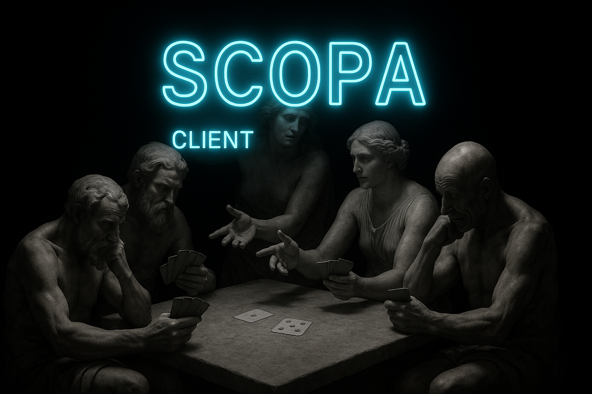
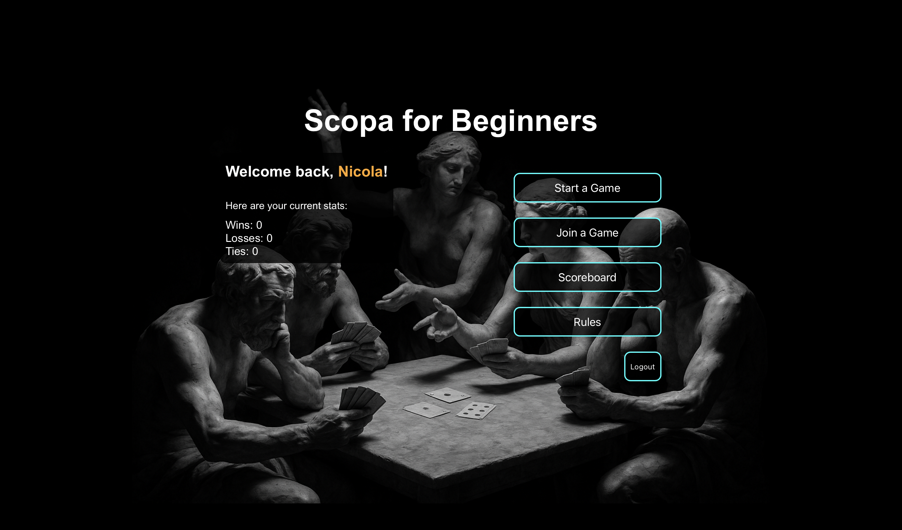
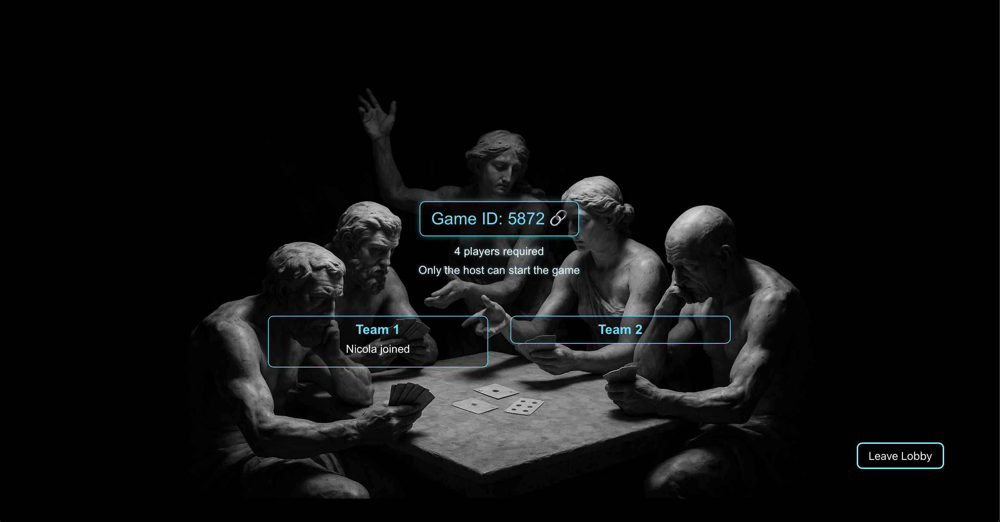
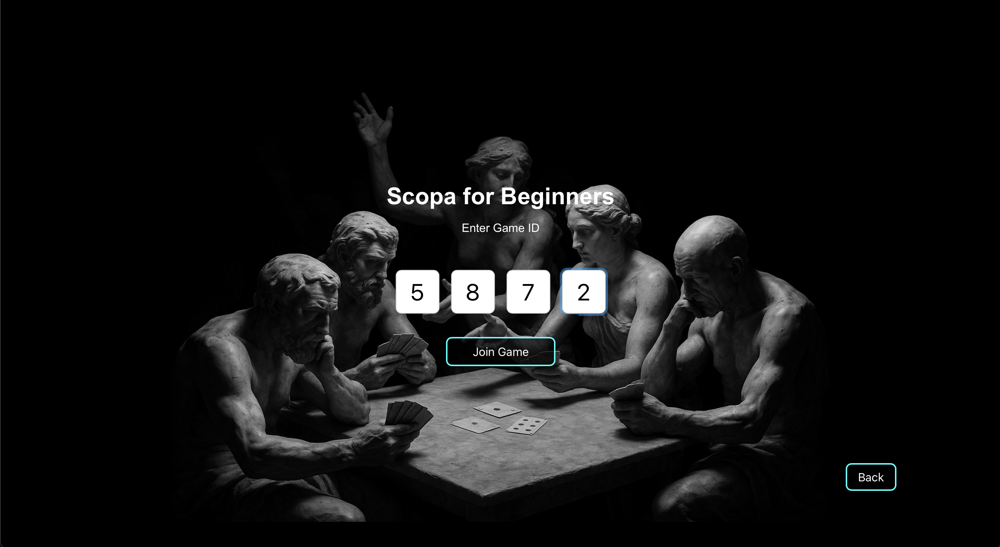
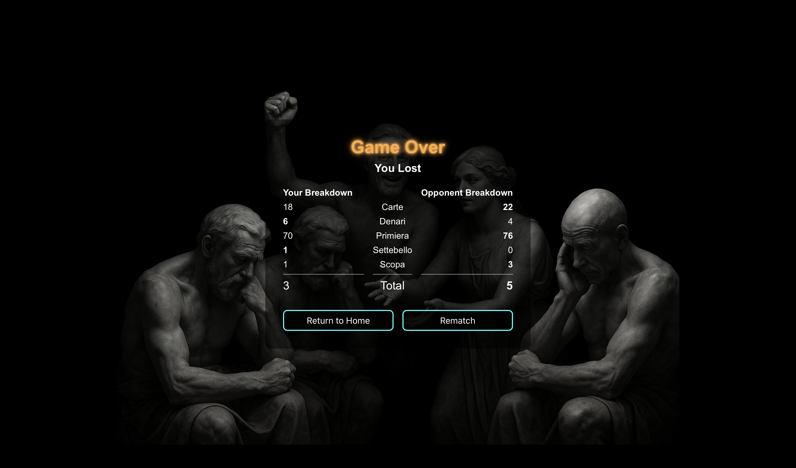
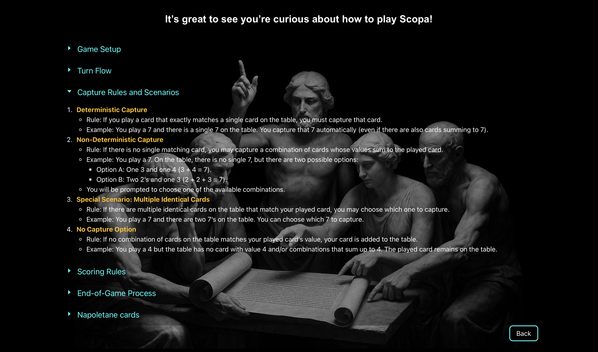

<p align="center">
  
</p>


[](https://sonarcloud.io/summary/new_code?id=5North_sopra-fs25-group-22-server)
[](https://sonarcloud.io/summary/new_code?id=5North_sopra-fs25-group-22-server)

[](https://opensource.org/licenses/MIT)

## 🧹Scopa for Beginners

This repository only contains the code of the frontend. For the backend implementation, check out this 
[repo](https://github.com/5North/sopra-fs25-group-22-server).

## 📖 Table of Contents

* [🗒️ Introduction](#introduction)
* [💡 Technologies](#technologies)
* [⚙️ High-Level Components](#high-level-components)
    * [Registration, Login & home](#registration-login--home )
    * [Lobby](#lobby)
    * [Game](#game)
    * [Game Result](#game-result)
    * [Rules](#rules)
    * [Scoreboard](#scoreboard)
* [🛠️ Launch & Deployment](#launch--deployment)
* [🚀 Roadmap](#roadmap)
* [🖋️ Authors & Acknowledgments](#authors--acknowledgments)
* [📜 License](#license)

<h2 id="introduction">🗒️ Introduction</h2>

🧹**Scopa for Beginners**🧹 aims to bring the beloved traditional italian cards game [Scopa](https://en.wikipedia.org/wiki/Scopa) 
to an international audience by creating an accessible digital version of the 2 versus 2 variant. The goal of this project is to create a user and 
beginner-friendly application client-server to allow both newcomers and hardcore fans of the game to conveniently play 
Scopa in their browser. To make it easier for beginners to learn the rules and achieve some flow, an integrated LLM 
assistant can suggest some possible options to play if help requested by the player. Real time communication via Websockets
allows to play this timeless classic with your friends without noticeable hiccups on a simple and no-fuss application,
that propose itself as an open source alternative to the usually paywalled or ads-filled commercial versions. 

<h2 id="technologies">💡 Technologies</h2>

* [Typescript](https://www.typescriptlang.org/) - TypeScript is JavaScript with syntax for types.
* [CSS](https://sass-lang.com/) - stylesheet language used to describe the presentation of HTML and XML documents.
* [Next.js](https://nextjs.org/) - A React framework for building fast, scalable web applications with server-side rendering and static site generation.
* [stompjs](https://stomp-js.github.io/) - A JavaScript client for the STOMP protocol over WebSocket.
* [Ant Design](https://ant.design/) – A comprehensive UI component library for building elegant and responsive web interfaces.
* [Vercel](https://vercel.com/) – Cloud platform for deploying and hosting modern web applications, optimized for Next.js.
* [npm](https://www.npmjs.com/) - Package manager for JavaScript, used to manage project dependencies and publish reusable code.
* [ESLint](https://eslint.org/) - A static code analysis tool for identifying and fixing problems in JavaScript and TypeScript code.
* [Figma](https://www.figma.com/) - browser-based tool for interface design and prototyping with real-time collaboration.


<h2 id="high-level-components">⚙️ High-level components</h2>

### Registration, Login & Home

The first page displayed when visiting our deployed [Website](https://sopra-fs25-group-22-client.vercel.app), allows to [register as a user](https://github.com/5North/sopra-fs25-group-22-client/blob/main/app/register/page.tsx), or [log in](https://github.com/5North/sopra-fs25-group-22-client/blob/main/app/login/page.tsx) if an account was already created. 

In the [homepage](https://github.com/5North/sopra-fs25-group-22-client/blob/main/app/home/page.tsx), the users see their own statistics (wins, losses and ties), as well as the options to start a game, join an existing lobby, view the ranking over all registered users (Scoreboard) and the Rules. 

### Lobby
When a users starts a game, they get redirected to the [lobbypage](https://github.com/5North/sopra-fs25-group-22-client/blob/main/app/lobbies/%5Bid%5D/page.tsx), where a Game ID consisting of 4 digits is displayed and is to be shared with other users, to play Scopa together. 

A [joining](https://github.com/5North/sopra-fs25-group-22-client/blob/main/app/join/page.tsx) user can enter the Game ID via 'Join a Game'.
All players in the same lobby can see who enters and leaves the lobby, as well as who which 2 players are in the same team.

Only the host can start a game, when there are 4 players in the lobby.

### Game
After the Host starts the game, all players from the lobby get redirected to the [game](https://github.com/5North/sopra-fs25-group-22-client/blob/main/app/game/%5Bid%5D/page.tsx). 

In the [gameview](https://github.com/5North/sopra-fs25-group-22-client/blob/main/app/components/ScopaGameView.tsx) each players is only able to see their own cards on the bottom, and the cards on the table. When hovering over these cards, the value and suit of the card is displayed. The cards of the other players are upside down. 

Team mates are displayed to the opposite of each other.

A neon green dot next to a players name, signals to all players whose turn it is. 

On the top to the right an AI button is visible, which can only be clicked by the player, if its their turn. This allows the player to get suggestions on what to play as the next move.

A timer counting down from 30 seconds, shows how long the current player has, to make his play. If the user does not click on any card, a random card of their deck is choosen and played.

Whenever a players does scopa (clears the table), an animation is displayed to all users. In addition, the counter next to the players who did scopa, adds +1.

Each user can quit the game at any time. When a user quits the game, game ends in a forfeit. 

### Game Result
After a game has ended, the [results](https://github.com/5North/sopra-fs25-group-22-client/blob/main/app/components/GameResultView.tsx) are displayed to each user, including a breakdown of their team and the opponent's team according to the scoring rules. 

The players have the option to either leave the lobby or 'Return to Home', which will redirect the user to the homepage.

If a player wants a [rematch](https://github.com/5North/sopra-fs25-group-22-client/blob/main/app/rematch/%5Bid%5D/page.tsx), they get redirect to the rematch page. Players who choose to have a rematch, are able to see other players, who have aso choosen to have a reamtch. 
Again, if there are 4 players, the host can start a new game.

### Rules
Users are able to view the [rules](https://github.com/5North/sopra-fs25-group-22-client/blob/main/app/rules/page.tsx) of Scopa, to better understand how to play the game. 
The rulespage include, game setup, turn flow, capture rules and scenarios, scoring rules, end-of-game process and finally a display of Napoletane cards.

### Scoreboard
Users are able to view the [scoreboard](https://github.com/5North/sopra-fs25-group-22-client/blob/main/app/scoreboard/page.tsx) of Scopa, to overall scores of all users are listed. 

<h2 id="launch--deployment">🛠️ Launch & Deployment</h2>

### Prerequisites and Installation
For your local development environment, you will need Node.js.\
You can download it [here](https://nodejs.org/download/release/v20.11.0/).\
npm comes bundled with Node.js.

If you happen to have a package manager the following commands can be used:

- **Homebrew:** `brew install node@20.11.0`
- **Chocolatey:** `choco install nodejs-lts --version=20.11.0`

After the installation, update the npm package manager to **10.4.0** by running ```npm install -g npm@10.4.0```\
You can ensure the correct version of node and npm by running ```node -v``` and ```npm --version```, which should give you **v20.11.0** and **10.4.0** respectively.\
Before you start your application for the first time, run this command to install all other dependencies, including React:

```npm install```

Next, you can start the (Scopa) app with:

```npm run dev```

Now you can open [http://localhost:3000](http://localhost:3000) to view Scopa in the browser.\
Notice that the page will reload if you make any edits. You will also see any lint errors in the console (use a Chrome-based browser).\

<h2 id="illustrations">Illustrations</h2>

<p align="center">
  
</p>

This is the first page that appears when following the the [link](https://sopra-fs25-group-22-client.vercel.app)

<p align="center">
  
</p>

After successfully registering or logging into an account the homepage is displayed.

<p align="center">
  
</p>

After creating a game, the game ID and the joined players are displayed.

<p align="center">
  
</p>

The players can enter the game ID to join an existing lobby

<p align="center">
  
</p>

After the host starts the game, all players get redirected to the game.

<p align="center">
  
</p>

When the game has ended, the breakdown of the game is displayed.

<p align="center">
  
</p>

For Beginners to understand on how to play the game, all the rules and information can be viewed here.


<h2 id="roadmap">🚀 Roadmap</h2>

- Implement a 1 versus 1 game mode
- Add the option to choose teams in the 2 versus 2 game.
- Add more encouragement messages
- Add language localization (IT, DE, FR ...)
- Implement to choose from different card decks
- Smoother movement of cards while playing

<h2 id="authors--acknowledgments">🖋️ Authors & Acknowledgements</h2>

### Authors

* [5North](https://github.com/5North)
* [Stefano Benzoni](https://github.com/sbenzo99)
* [Seyda Gündüz](https://github.com/Seydi89)
* [Shellmy Chakkaith](https://github.com/shellmychakkaith)

### Acknowledgements

We would like to thank our tutor []() for his support and guidance during this course, as well as all the teaching and 
tutoring team of the Sopra course.

<h2 id="license">📜 License</h2>

[](https://opensource.org/licenses/MIT)

This work is licensed under the MIT License - see the LICENSE.md file for details.

The project is based on the [sopra-fs25-template-client](https://github.com/HASEL-UZH/sopra-fs25-template-client)
, which is licensed under the Apache 2.0 license - see the LICENSE.Apache-2.0 file for the original notice.
